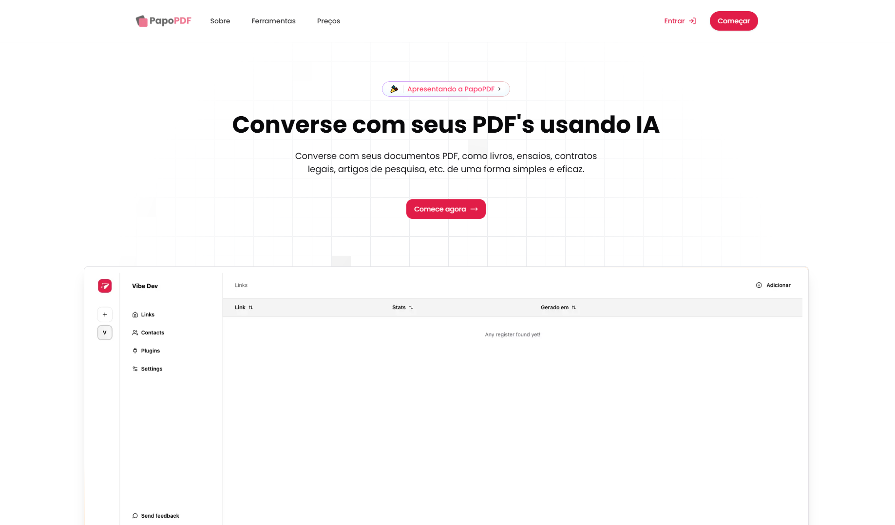

  

 

<h3 align="center">Plataforma Open-Source para conversar com seus documentos PDF  Visite o site <a href="https://papopdf.com.br" target="_blank">clicando aqui!</a></h3>

PapoPDF é uma aplicação que permite a você conversar diretamente com documentos PDF de forma simples e eficiente. Com uma interface intuitiva, basta fazer o upload do arquivo para começar a explorar informações, tirar dúvidas ou gerar insights rapidamente. A tecnologia de IA por trás da plataforma entende o conteúdo do PDF e oferece respostas precisas para suas perguntas. Ideal para estudantes, profissionais e curiosos, o PapoPDF transforma a interação com documentos em uma experiência dinâmica e prática.

 

  

 

# Funcionalidades

- Análise Rápida de Documentos: Faça upload de um arquivo PDF e obtenha respostas imediatas para perguntas específicas sobre o conteúdo.

- Resumo e Extração de Dados: Resuma textos extensos, extraia dados relevantes e encontre informações importantes sem precisar ler todo o documento.

- Busca por Palavras-Chave: Localize rapidamente termos, frases ou seções específicas dentro de um PDF.

- Aplicação Multissetorial: Atenda às necessidades de profissionais jurídicos, acadêmicos, financeiros, educacionais e outros, adaptando a análise às demandas de cada área.

- Interface Intuitiva e Prática: Interaja com seus documentos de maneira simples e acessível, sem necessidade de habilidades técnicas.

- Apoio à Tomada de Decisão: Utilize insights obtidos de relatórios, contratos e artigos para embasar decisões estratégicas com agilidade e precisão.

 

# Como Contribuir

Estamos sempre abertos a contribuições da comunidade! Se você deseja contribuir, siga os passos
abaixo:

1. Faça um fork do projeto.
2. Crie uma branch para sua feature (git checkout -b feature/nova-feature).
3. Faça commit das suas alterações (git commit -m 'Adiciona nova feature').
4. Faça push para a branch (git push origin feature/nova-feature).
5. Abra um Pull Request.

 

# O que falta para finalizar?

- planos
  - Fazer os planos de assinatura no stripe
  - Cards com preço na lading page e modal
  - Medir as funcionalidades de cada e testar a limitação de cada
- Terminar os temos
- Testar o maximo de upload (bug com documentos mais extensos)
- Configurar o dominio papopdf.com
- Configurar Cloudflare com VPS
