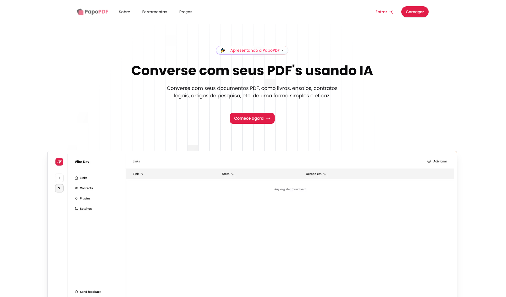

  <h1>PapoPDF</h1>
  
Converse com seus PDF's usando IA

 

# O que falta para finalizar?

- planos 
  - Fazer os planos de assinatura no stripe
  - Cards com preço na lading page e modal
  - Medir as funcionalidades de cada e testar a limitação de cada
- Terminar os temos
- Testar o maximo de upload (bug com documentos mais extensos)
- Configurar o dominio papopdf.com
- Configurar Cloudflare com VPS